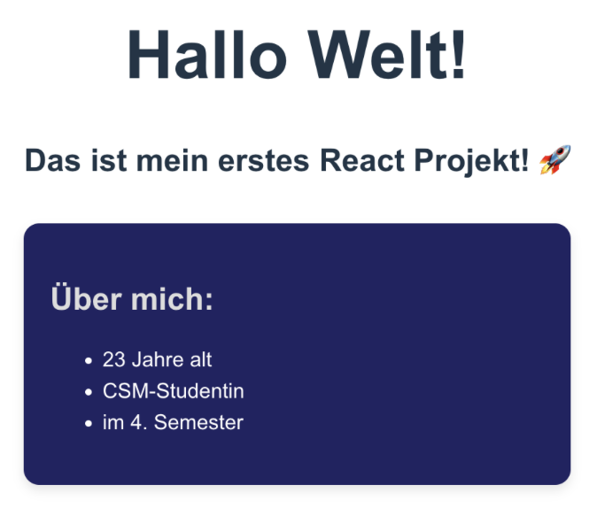

# Übung 1 – JSX und Komponenten

## Zielsetzung

In dieser Übung wiederholst und vertiefst du die Inhalte aus den Präsentationsfolien.  
Du setzt praktisch um, was du über **React-Projektinitialisierung**, **Komponenten** und **JSX** gelernt hast.  

## Aufgabenstellung

1. **Projekt initialisieren**  
Setze ein neues React-Projekt mit **Vite** auf, wie in den Folien beschrieben.

2. **Ordnerstruktur erstellen**  
Erstelle im Projekt-Root einen Ordner namens `components`.

3. **Komponenten erstellen**
Erstelle zwei Components im Ordner `components` und style sie mit Inline-CSS (wie im Beispiel oben):
    - **Greeting** (Enthält zwei Überschriften (`<h1>`, `<h2>`).)
    - **AboutMe** (Enthält eine Überschrift und eine Liste (`<ul>` mit mehreren `<li>`-Elementen).)

4. **Komponenten in die App einbinden**
Importiere beide Komponenten in deine `App.tsx`. Verwende unterschiedliche Methoden:
    - **Greeting** mit **`React.createElement()`**
    - **AboutMe** mit **JSX-Syntax**

Nach erfolgreichem Abschluss der Aufgabe sollte deine Anwendung ungefähr so aussehen wie das gezeigte Beispiel.

