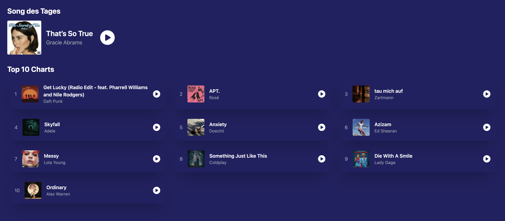

# Übung 2 – Komponentenlogik und CSS

## Zielsetzung

In dieser Übung wiederholst und vertiefst du die Inhalte aus den Präsentationsfolien.  
Du setzt praktisch um, was du über **Props**, **Event Handling**, **Hooks** und **CSS Styling mit Tailwind** gelernt hast.

## Aufgabenstellung

Bevor du anfängst: Schaue dir den bestehenden Code gut an (`App.tsx`, `ChartsPage.tsx`, `AudioContext.tsx`, `SongOfTheDay.tsx` und `types.ts`)! Hilfestellungen zu den Aufgaben stehen im Code. Tailwind ist bereits installiert.

1. **AudioProvider**
   Nutze den in `AudioContext.tsx` definierten AudioProvider in `App.tsx`, sodass alle Child Components den `AudioContext` benutzen können.
2. **Einbindung Song des Tages**
   Lasse den in `SongOfTheDay.tsx` definierten Song des Tages auf der `ChartsPage` anzeigen. Wenn du weißt wie, kannst du auch einen eigenen Song aussuchen der hier angezeigt wird. ;)
   Du hast bei Aufgabe 1 + 2 alles richtig gemacht, wenn auf der Webseite ein Song angezeigt wird, den du abspielen kannst
3. **API Call**
   Schreibe in der `ChartsPage` einen API Call, der die aktuellen Top 10 Songs von Deezer abruft (Schnittstelle: `/api/chart/0/tracks?limit=10`).
   Du hast alles richtig gemacht, wenn du die Namen der Titel auf der Webseite angezeigt bekommst.
4. **SongCard Component**
   Implementiere eine SongCard Component (mit CSS Styling). Angezeigt werden soll der Titel, Künstlername, das Album-Cover und ein Play/Stop-Button, der anzeigt, ob das aktuelle Lied gerade gespielt wird. Du kannst dich von `SongOfTheDay.tsx` inspirieren lassen. Als Props sollst du den Track und die Zahl der Platzierung in den Charts mitgeben.

Nach erfolgreichem Abschluss der Aufgabe sollte deine Anwendung ungefähr so aussehen wie das gezeigte Beispiel.

