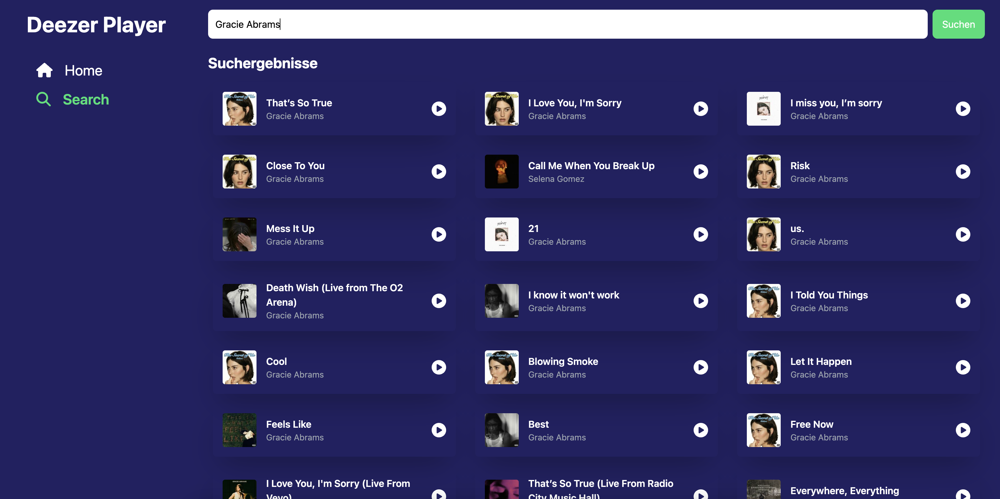

# Übung 3 - Routing

## Zielsetzung

In dieser Übung wiederholst und vertiefst du die Inhalte aus den Präsentationsfolien.  
Du setzt praktisch um, was du über **Routing** gelernt hast.

## Aufgabenstellung

Bevor du anfängst: Schaue dir den bestehenden Code gut an! Hilfestellungen zu den Aufgaben stehen im Code. Tailwind ist bereits installiert.

1. **Installiere den React Router**
2. **`SidebarLink` Component**
   Passe die Component SidebarLink so an, dass man einen beliebigen Link damit definieren kann, welcher zeigt, ob er gerade aktiv ist, also ob man sich auf der entsprechenden Seite befindet.
3. **Links in `AppLayout`**
   Passe den `SidebarLink` in `AppLayout` so an, dass er deinen vorherigen Änderungen entspricht.
4. **Kindrouten**
   Stelle sicher, dass die Kindrouten in `AppLayout` angezeigt werden,
5. **`AppLayout` benutzen**
   Nutze in `App.tsx` einen Router mit dem `AppLayout` und einer Index-Seite (`ChartsPage`).
   Später soll unter dem Pfad `/search` auch eine Search-Seite hinzugefügt werden .
6. **`SearchPage`**
   Erstelle eine `SearchPage`. Sie soll ein Inputfeld und einen "Suchen"-Button haben. Nach der Suche sollen die Ergebnisse mit auf der `ChartsPage` in einem Grid von `SongCards` angezeigt werden.
   Füge dann den `SidebarLink` zur Search-Seite im `AppLayout` hinzu. Als Icon kannst du `faMagnifyingGlass` von FontAwesome benutzen.

Nach erfolgreichem Abschluss der Aufgabe sollte deine Anwendung ungefähr so aussehen wie das gezeigte Beispiel.

